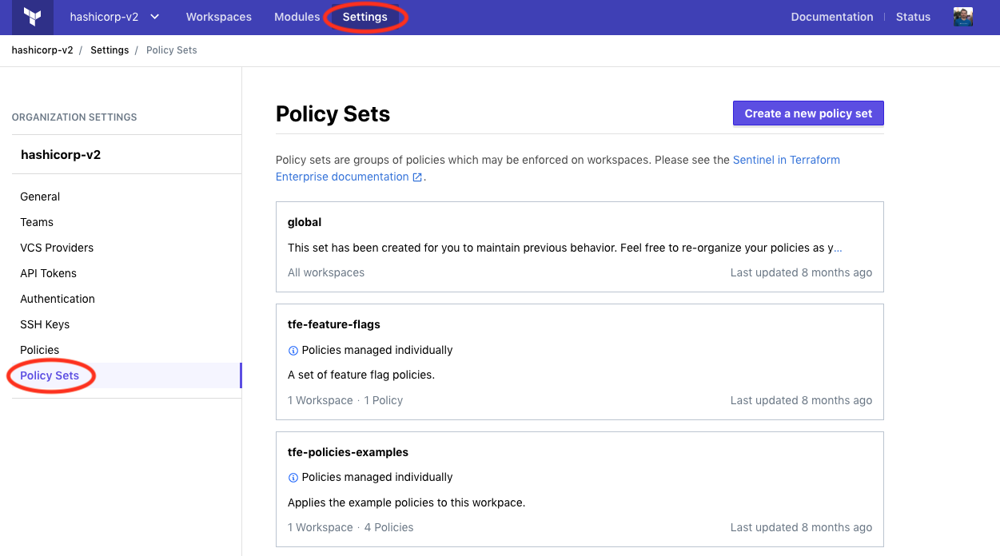

# Sentinel-Terraform-Enterprise
Sentinel-Terraform-Enterprise is for managing terraform-enterprise by making restrictions via policies

Terraform Enterprise is our self-hosted distribution of Terraform Cloud. It offers enterprises a private instance of the Terraform Cloud application, with no resource limits and with additional enterprise-grade architectural features like audit logging and SAML single sign-on.

Sentinel is an embeddable policy as code framework to enable fine-grained, logic-based policy decisions that can be extended to source external information to make decisions

Sentinel gives operations teams the governance capabilities they need to ensure that all infrastructure provisioned with Terraform Enterprise complies with their organization's provisioning rules. 

## How to write Sentinel-policies :
  ### a)Sentinel files/file-structure in Github:
  There are two types of files : ".sentinel" , "sentinel.hcl"
  - In <name>.sentinel files, we need to place our policy-code
  - In sentinel.hcl file, we need to mention which policy need to be applied and which level.
    There are three type of levels: 
    - hard-mandatory requires that the policy passes. If a policy fails, the run is halted and may not be applied until the failure is resolved.
    - soft-mandatory is much like hard-mandatory, but allows an administrator to override policy failures on a case-by-case basis.
    - advisory will never interrupt the run, and instead will only surface policy failures as informational to the user.
  - Refer this sample-example for better understanding structure: [Example](https://github.com/Nokku-Organization/Sentinel-Terraform-Enterprise/tree/master/Example)
  
  
  ### b)What is sentinel-policy:
  
  ### c)How to write a policy:
  
  Sentinel expects there to be a main rule. The value of this rule is the result of the entire policy.

If the result of main is true, the policy passes. If the value is anything else (false or a non-boolean value), the policy fails. The exact meaning of what happens a policy passes or fails is dependent on the host system

Sentinel policies are executed top-down

The example below is about the simplest practical example of Sentinel. It is reasonable to imagine this as a realistic policy. This shows that in most cases, Sentinel will be extremely simple:

value = 10
main = value > 5
or
main = rule { request.method is "GET" and request.headers contains "X-Key" }

Rules form the basis of a policy by representing behavior that is either passing or failing (true or false). Rules are a first class language construct in Sentinel. A policy can and should be broken down into rules to aid with readability, testability, and performance.

An example usage of rules is shown below:

is_sunny     = rule { weather is "sunny" }
is_wednesday = rule { day is "wednesday" }
main = rule { is_sunny and is_wednesday }

  
  There are 4 imports we make use of.
  1)tfplan- most commonly used:
  tfplan

    
    ├── module() (function)
    │   └── (module namespace)
    │       ├── path ([]string)
    │       ├── data
    │       │   └── TYPE.NAME[NUMBER]
    │       │       ├── applied (map of keys)
    │       │       └── diff
    │       │           └── KEY
    │       │               ├── computed (bool)
    │       │               ├── new (string)
    │       │               └── old (string)
    │       └── resources
    │           └── TYPE.NAME[NUMBER]
    │               ├── applied (map of keys)
    │               ├── destroy (bool)
    │               ├── requires_new (bool)
    │               └── diff
    │                   └── KEY
    │                       ├── computed (bool)
    │                       ├── new (string)
    │                       └── old (string)
    ├── module_paths ([][]string)
    ├── terraform_version (string)
    ├── variables (map of keys)
    │
    ├── data (root module alias)
    ├── path (root module alias)
    ├── resources (root module alias)
    │
    ├── config (tfconfig namespace alias)
    └── state (tfstate import alias)
    
     
  ### d)Example explanation of a sentinel-policy code

## How to associate Sentinel-policies with Terraform-Enterprise:
To manage policy sets, go to the "Policy Sets" section on the organization settings page.

policy-sets-navigate

Policy sets enforced on all workspaces are marked "All workspaces" in this list; other policy sets show how many workspaces they are enforced on. You may also notice policy sets with an informational tag that reads "Policies managed individually", which indicates that the policy set is not versioned and uses policy relationships (deprecated). These policy sets will need to be migrated in the future.

To create a new policy set, click the "Create a new policy set" button; to edit an existing set, click its entry in the list. Click the "Create policy set" or "Update policy set" button when finished.

When creating or editing a policy set, the following fields are available:

Name: The name of the policy set, which is used in the UI. Must be unique to your organization. Accepts letters, numbers, -, and _.
Description: A description of the policy set's purpose. The description can be any length and supports Markdown rendering.
Scope of policies: Whether the set should be enforced on all workspaces, or only on a chosen list of workspaces.
VCS repo or "Upload via API": This area allows selecting a VCS repository from an existing OAuth client connection. Choosing "Upload via API" will not configure VCS integration, and instead tarballs of policy sets may be uploaded via the API. See the policy set versions for more information on uploading policy sets using the API.
VCS Branch: This field allows specifying the branch within a VCS repository from which to import new versions of policies. If left blank, the value your version control provides as the default branch of the VCS repository is used.
Policies Path: This field allows specifying a sub-directory within a VCS repository for the policy set files. This allows maintaining multiple policy sets within a single repository. The value of this field should be the path to the directory containing the sentinel.hcl configuration file of the policy set you wish to configure. Any files in the repository which are not within this path will not be included when the policy set is cloned. Commits to the repository which do not match the specified directory will be ignored. If left blank, the root of the repository is used. A leading / may be used, but is optional (relative paths are assumed to originate from the root of the repository).
Workspaces: Which workspaces the policy set should be enforced on. This is only shown when the scope of policies is set to "Policies enforced on selected workspaces." Use the drop-down menu and "Add workspace" button to add workspaces, and the trash can (🗑) button to remove them.
Parameters: A list of key/value parameters that will be sent to the Sentinel runtime when a policy check is being performed for the policy set. If the value can be parsed as JSON, it will be sent to Sentinel as the corresponding type (string, boolean, integer, map or list). If it fails JSON validation, it will be sent as a string. For more information on parameters, see the Sentinel parameter documentation.

## HOW TO TEST SENTINEL-POLICIES LOCALLY: 
  ### Installing Sentinel CLI
  we'll use Sentinel CLI to learn how to write and test policies for Terraform Cloud(Terraform Enterprise). Download it [here](https://docs.hashicorp.com/sentinel/downloads/).

  After downloading Sentinel, unzip the package. Sentinel CLI runs as a single binary named sentinel. Any other files in the package can be safely removed and Sentinel will still function.

  After Extracting move this 'sentinel' binary to '/usr/local/bin/' or for exact path setting pls follow the below process.
  #### PATH SETTING:
  The final step is to make sure that the sentinel binary is available on the PATH. See [this page](https://stackoverflow.com/questions/14637979/how-to-permanently-set-path-on-linux-unix) for instructions on setting the PATH on Linux and Mac. [This page](https://stackoverflow.com/questions/1618280/where-can-i-set-path-to-make-exe-on-windows) contains instructions for setting the PATH on Windows.

  #### Verifying the Installation:
  After installing Sentinel CLI, verify the installation was successful by opening a new terminal session and checking that the sentinel binary is available. By executing sentinel, you should see help output similar to the following:
      
      $ sentinel
      Usage: sentinel [--version] [--help] <command> [<args>]

      Available commands are:
          apply      Execute a policy and output the result
          fmt        Format Sentinel policy to a canonical format
          test       Test policies
          version    Prints the Sentinel runtime version
      
   If you get an error that the binary could not be found, then your PATH environment variable was not setup properly. Please go back and ensure that your PATH variable contains the directory where Sentinel was installed.
  
  For additional information : [AdditionalInfo](https://learn.hashicorp.com/terraform/sentinel/sentinel-intro#sentinel-cli)
  
  #### Using sentinel-cli to test sentinel-polcies-locally:
  
